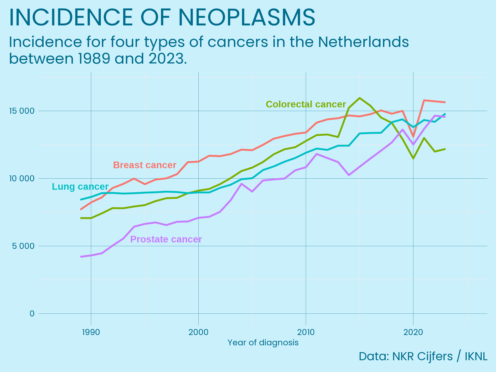
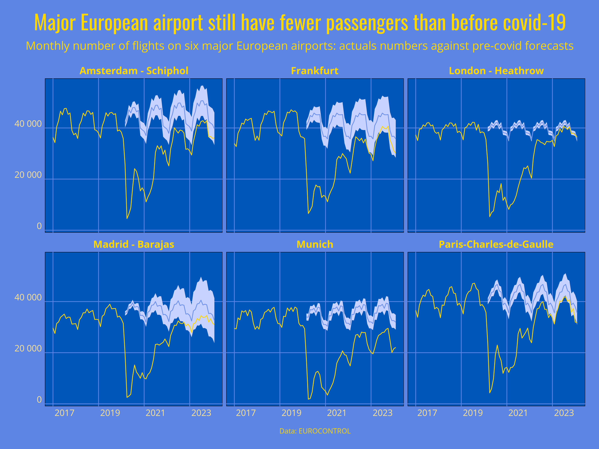
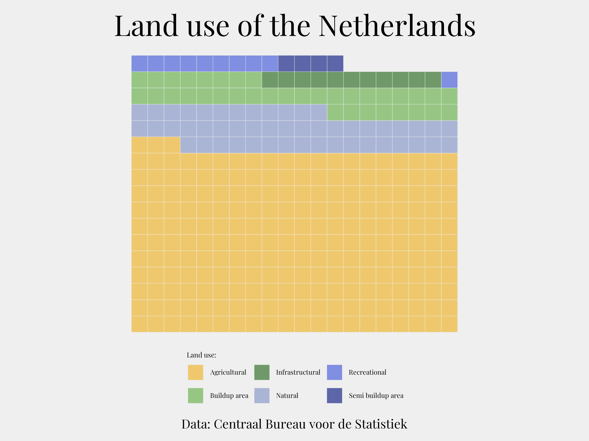
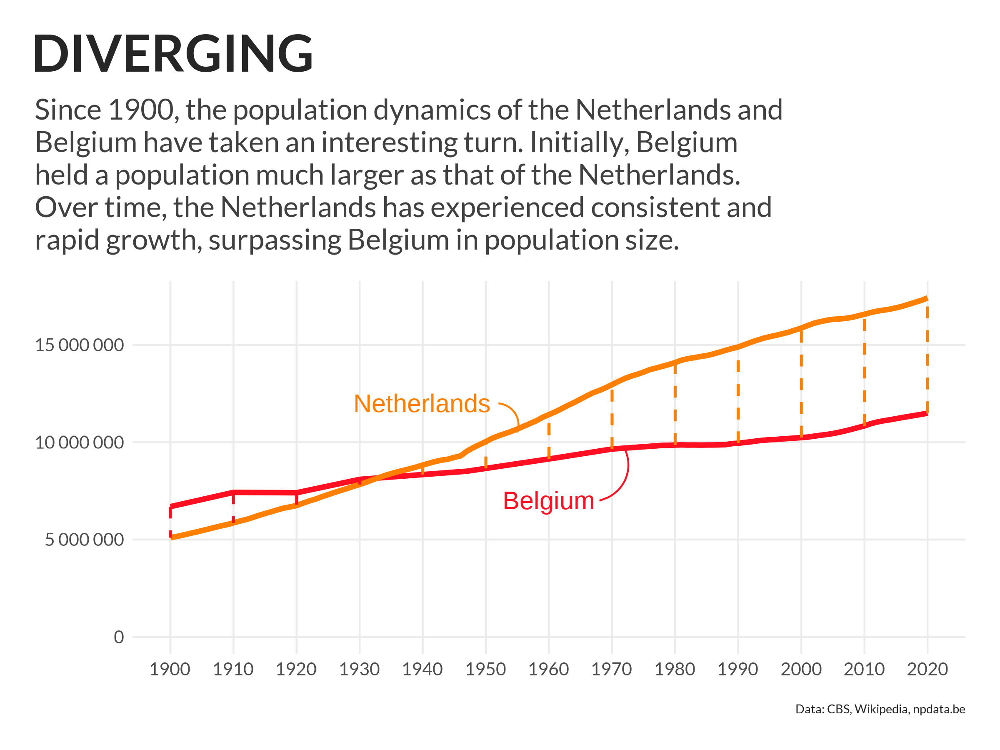
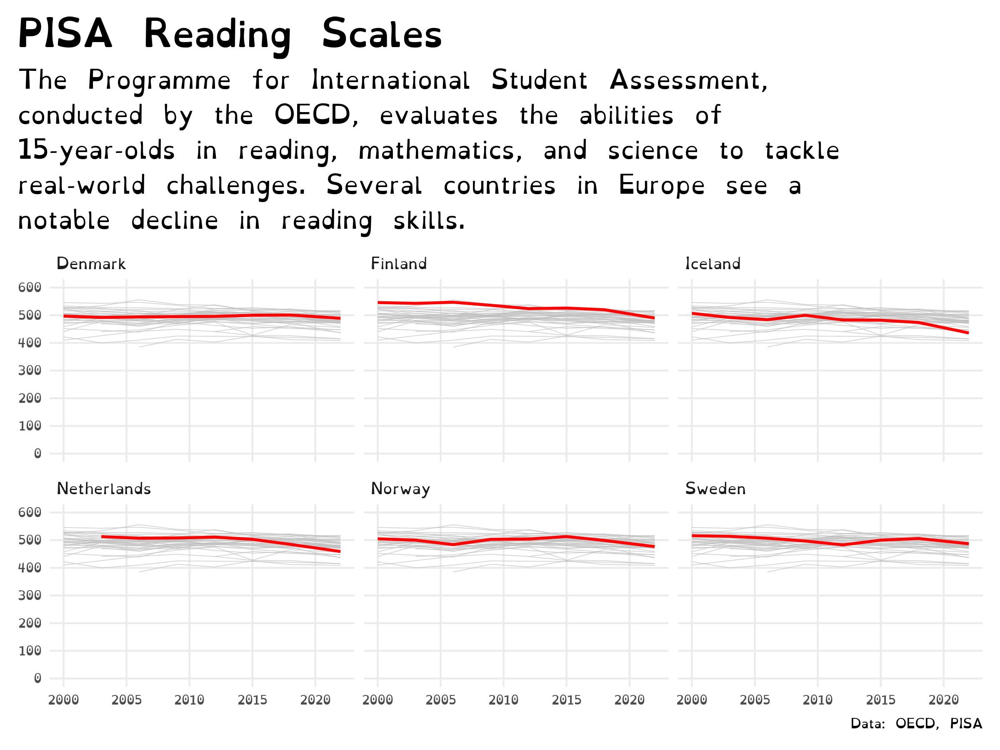
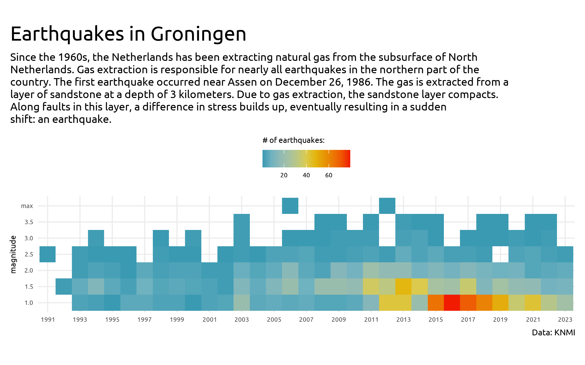
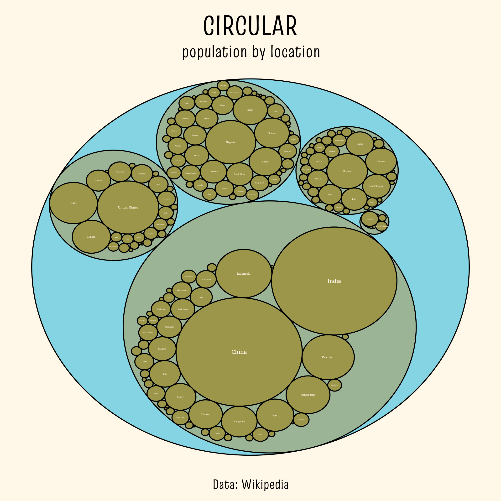
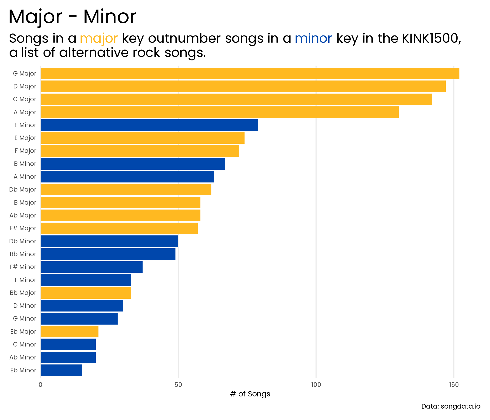
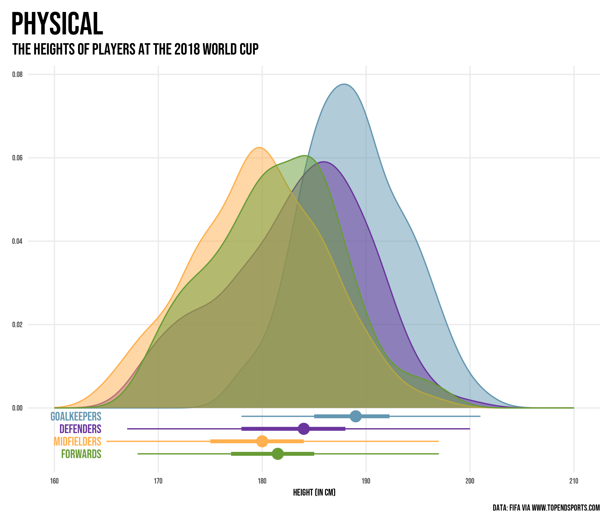

# 30DayChartChallenge

The [#30DayChartChallenge](https://30daychartchallenge.org/) is a community-driven event with the goal to create a data visualization on a certain topic each day of April.

----

<table>
  <tr>
    <td>Day 1 - Part to whole</td>
    <td>Day 2 - Neo</td>
  </tr>
  <tr>
    <td></td>
    <td></td>
  </tr>
    <tr>
    <td>Day 3 - Makeover</td>
    <td>Day 4 - Waffle</td>
  </tr>
  <tr>
    <td></td>
    <td></td>
  </tr>
  <tr>
    <td>Day 5 - Diverging</td>
    <td>Day 6 - Data day: OECD</td>
  </tr>
  <tr>
    <td></td>
    <td></td>
  </tr>
    <tr>
    <td>Day 7 - Hazards</td>
    <td>Day 8 - Circular</td>
  </tr>
  <tr>
    <td></td>
    <td></td>
  </tr>
    <tr>
    <td></td>
    <td></td>
  </tr>
    <tr>
    <td>Day 9 - Major/Minor</td>
    <td>Day 10 - Physical</td>
  </tr>
  <tr>
    <td></td>
    <td></td>
  </tr>
</table>
