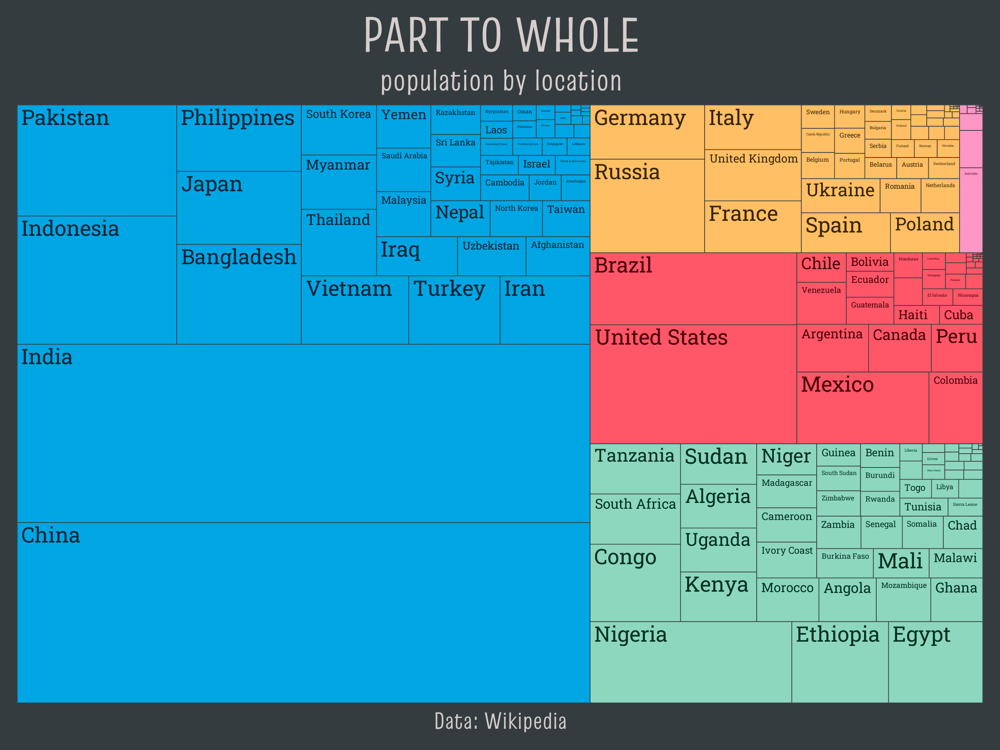

# 30DayChartChallenge

The [#30DayChartChallenge](https://30daychartchallenge.org/) is a community-driven event with the goal to create a data visualization on a certain topic each day of April.

----

<table>
  <tr>
    <td>Day 1 - Part to whole</td>
    <td>Day 2 - Waffle</td>
  </tr>
  <tr>
    <td></td>
    <td></td>
  </tr>
    <tr>
    <td>Day 3 - Fauna/flora</td>
    <td>Day 4 - Historical</td>
  </tr>
</table>
